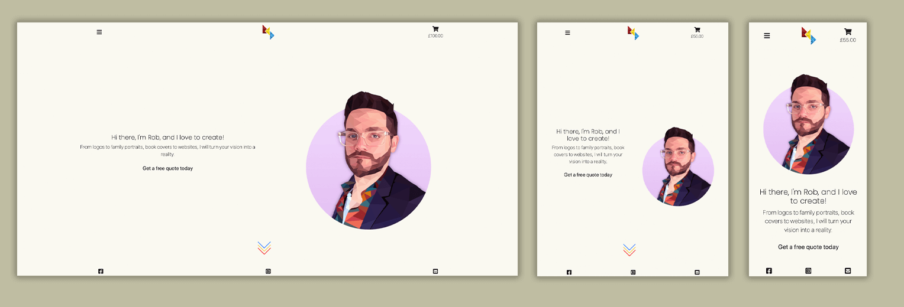

# Milestone Project 4 - Robert Clark Design

- [Host Link](https://robertclarkdesign.herokuapp.com/)
- [GitHub Repo Link](https://github.com/Robert-Clark-1990/MS4_RCD)

# Table of Contents

 - [**Introduction**](#introduction)

 - [**User Experience**](#user-experience)
    - [Project Goals](#project-goals)
    - [User Stories](#user-stories)
    - [Wireframes](#wireframes)
    - [Site Design](#site-design)
    - [Database Design](#database-design)

 - [**Features**](#features)
    - [Existing Features](#existing-features)
    - [Future Features To implement](#future-features-to-implement)

 - [**Technologies Used**](#technologies-used)
    - [Languages](#languages)
    - [APIS and Frameworks](#apis-and-frameworks)
    - [Hosting Databases and Version Control](#hosting-databases-and-version-control)
    - [Websites](#websites)

 - [**Testing**](#testing)
    - [Bug Fixes](#bug-fixes)
    - [Bugs Unable To Fix](#bugs-unable-to-fix)
    - [Browser Compatibility](#browser-compatibility)
    - [Responsive Design](#responsive-design)
    - [Validator Tests](#validator-tests)
    - [User Review](#user-review)
    - [Meeting Project Needs](#meeting-project-needs)

 - [**Deployment**](#deployment)
    - [Heroku Deployment](#heroku-deployment)
    - [Running This Project Locally](#running-this-project-locally)

 - [**Credits**](#credits)
    - [Content](#content)
    - [Media](#media)
    - [Code](#code)
    - [Acknowledgements](#acknowledgements)

---

# Introduction


For the final project in the Code Institute course, I wanted to create something personal and important to me and my future as a Software Developer. I have been a hugely creative individual
my whole life, and have worked in the past as a freelance Graphic Designer and Digital Marketer through the moniker of **Robert Clark Design**. I decided that I wanted to build this final project 
into a portfolio of my work and a place where I can sell my design and development services.

---

# User Experience

## Project Goals

**Robert Clark Design** is a full stack website that showcases a portfolio of design and development projects. The purpose is to demonstrate the work and skillset of the site user in an inviting and stylish way in order to encourage site visitors to request and purchase an array of available products, or purchase a commission package. Once a user has purchased a product, they will be able to log in via the email and password and view their order history, or if they purchased a commission package, they will be able to upload images for reference. The site owner will be able to access uploaded images for the commission. Once the commission is complete, the customer will be invited to leave a testimonial which will display on the site.


## User Stories

|   As A       |  I want to be able to...                                                                        |
| :----------  | :---------------------------------------------------------------------------------------------- |
| Site User    | Quickly and easily understand the purpose of the site                                           |
| Site User    | View a list of products & services available                                                    |
| Site User    | View individual products & services                                                             |
| Site User    | Sort for products & services that fit my requirements                                           |
| Site User    | Select products & services I want and add them to my basket                                     |
| Site User    | Easily view the total cost of my purchases at any time                                          |
| Site User    | Add additional information to inform designer on project requirements                           |
| Site User    | Easily locate an inbuilt contact form to request quotes on unique projects                      |
| Site User    | Pay for services via an inbuilt payment service                                                 |
| Site User    | Sign in as a customer to view order history and upload commission images                        |
| Site Owner   | Log in as a special user and view a list of all orders and uploaded images                      |
| Site Owner   | Handle the customer request and upload of images all through the site                           |
| Site Owner   | Showcase a portfolio of work which can be changed or removed through the site                   |
| Site Owner   | Showcase testimonials from previous customers which can be added to or removed through the site |
| Site Owner   | Display an about the designer section to humanise the work and encourage users to commit        |
| Site Owner   | Add, edit, view and delete items in the shop all through the site                               |


## Wireframes

In order to visualise the project before creation, a series of wireframes were created. These outlined the basic structure of the site and the individual page layouts. Over the course of
the project, the designs evolved to meet the expanded scope, however the basic structure and design remained intact. 


You can download a pdf of the wireframes [here](documents/wireframes.pdf)


## Site Design

In order to draw focus to the work in the portfolio, the site will have a clean, minimalist design, encouraging white space where possible. This will be juxtaposed through the use of geometric art, which is favoured by the site owner and used throughout his work.

### Colour Scheme


In keeping with the site logo, a vibrant primary red colour will be used alongside an off white background to draw attention to the work. However, the site will not be limited to the use of primary colours and will expand where necessary to encourage site users to view everything the site has to offer.

### Typography

To match the minimalistic design of the site, the Google Font [Poppins](https://fonts.google.com/specimen/Poppins?preview.text=Robert%20Clark%20Design&preview.text_type=custom) was used. This font was selected to ensure user accessibility and readability was always at the forefront of site design.

### Artwork

A strong focus on geometric design was used throughout the site, showcasing the site owner's penchant for the style. However, this was never limited to solely this style as the main purpose of the site was to showcase a wide array of talent. This is never more prevalent than on the portfolio page, wherein the site user can view a range of the site owner's previous work.


## Database Design

All data related to this project is saved in JSON files across three apps. The Portfolio app is separated from the rest as it contains data from previous works, and would only be updated with new information if a new client was taken on. The Products app contains JSON files for Products and Categories. Users who purchase a commission package will then be invited to leave a testimonial, which will bring forward data to be used in the Testimonials app.
The model below was created using [Draw SQL](https://drawsql.app/rob-clark/diagrams/rcd)


Across the project, a collection of Models were created to work with these JSON files and other information created and implemented throughout the site. These models can be viewed below:


### Checkout App

#### Order Model

| Name                     | Key             | Type                 | Validation                                                                          |
| ------------------------ | --------------- | -------------------- | ----------------------------------------------------------------------------------- |
| Order Number             | order_number    | models.CharField     | max_length=32, null=False, editable=False                                           |
| User Profile             | user_profile    | models.ForeignKey    | UserProfile, on_delete=models.SET_NULL, null=True, blank=True,related_name='orders' |
| Full Name                | full_name       | models.CharField     | max_length=70, null=False, blank=False                                              |
| Email                    | email           | models.EmailField    | max_length=254, null=False, blank=False                                             |
| Phone Number             | phone_number    | models.CharField     | max_length=20, null=False, blank=False                                              |
| Country                  | country         | CountryField         | blank_label='Country *', null=False, blank=False                                    |
| Postcode                 | postcode        | models.CharField     | max_length=20, null=True, blank=True                                                |
| Town or City             | town_or_city    | models.CharField     | max_length=40, null=False, blank=False                                              |
| Street Address 1         | street_address1 | models.CharField     | max_length=100, null=False, blank=False                                             |
| Street Address 2         | street_address2 | models.CharField     | max_length=100, null=True, blank=True                                               |
| County                   | county          | models.CharField     | max_length=80, null=True, blank=True                                                |
| Date                     | date            | models.DateTimeField | auto_now_add=True                                                                   |
| Delivery Cost            | delivery_cost   | models.DecimalField  | max_digits=6, decimal_places=2, null=False, default=0                               |
| Order Total              | order_total     | models.DecimalField  | max_digits=10, decimal_places=2, null=False, default=0                              |
| Grand Total              | grand_total     | models.DecimalField  | max_digits=10, decimal_places=2, null=False, default=0                              |
| Original Bag             | original_bag    | models.TextField     | null=False, blank=False, default=''                                                 |
| Stripe Payment Intent ID | stripe_pid      | models.CharField     | max_length=254, null=False, blank=False, default=''                                 |

#### OrderLineItem Model

| Name            | Key             | Type                 | Validation                                                                          |
| --------------- | --------------- | -------------------- | ----------------------------------------------------------------------------------- |
| Order           | order           | models.ForiegnKey    | Order, null=False, blank=False, on_delete=models CASCADE, related_name='lineitems'  |
| Product         | product         | models.ForeignKey    | Product, null=False, blank=False, on_delete=models.CASCADE                          |
| Quantity        | quantity        | models.IntegerField  | null=False, blank=False, default=0                                                  |
| Line Item Total | lineitem_total  | models.DecimalField  | max_digits=6, decimal_places=2, null=False, blank=False, editable=False             |


### Portfolio App

#### Project Model

| Name            | Key        | Type                | Validation                             |
| --------------- | ---------- | ------------------- | -------------------------------------- |
| SKU             | sku        | models.TextField    |                                        |
| Name            | name       | models.TextField    |                                        |
| Paragraph 1     | para_1     | models.TextField    |                                        |
| Paragraph 2     | para_2     | models.TextField    | null=True, blank=True                  |
| Paragraph 3     | para_3     | models.TextField    | null=True, blank=True                  |
| Keywords        | keywords   | models.TextField    |                                        |
| Link            | link       | models.URLField     | max_length=1024, null=True, blank=True |
| Image           | image      | models.ImageField   | null=True, blank=True                  |


### Products App

#### Product Model

| Name                 | Key         | Type                 | Validation                                       |
| -------------------- | ----------- | -------------------- | ------------------------------------------------ |
| Category             | category    | models.ForeignKey    | 'Category', null=True, on_delete=models.SET_NULL |
| SKU                  | sku         | models.CharField     | max_length=254, null=True, blank=True            |
| Name                 | name        | models.CharField     | max_length=254                                   |
| Description          | description | models.TextField     |                                                  |
| Terms and Conditions | t_and_c     | models.TextField     | null=True, blank=True                            |
| Price                | price       | models.DecimalField  | max_digits=6, decimal_places=2                   |
| Digital              | is_digital  | models.BooleanField  | default=False, null=True, blank=True             |
| Image Url            | image_url   | models.URLField      | max_length=1024, null=True, blank=True           |
| Image                | image       | models.ImageField    | null=True, blank=True                            |


### Profile App

#### UserProfile Model

| Name             | Key                  | Type                 | Validation                                    |
| ---------------- | -------------------- | -------------------- | --------------------------------------------- |
| User             | user                 | OneToOneField 'User' | on_delete=models.CASCADE                      |
| Phone Number     | default_phone_number | models.CharField     | max_length=20, null=True, blank=True          |
| Street Address 1 | street_address1      | models.CharField     | max_length=80, null=True, blank=True          |
| Street Address 2 | street_address2      | models.CharField     | max_length=80, null=True, blank=True          |
| Town or City     | default_town_or_city | models.CharField     | max_length=40, null=True, blank=True          |
| County           | default_county       | models.CharField     | max_length=80, null=True, blank=True          |
| Postcode         | default_postcode     | models.CharField     | max_length=20, null=True, blank=True          |
| Country          | default_country      | CountryField         | blank_label='Country', null=True, blank=True  |

#### ImageUpload Model

| Name             | Key                    | Type                 | Validation                              |
| ---------------- | ---------------------- | -------------------- | --------------------------------------- |
| User             | user                   | models.CharField     | max_length=254, null=False, blank=True  |
| Title            | title                  | models.CharField     | max_length=254                          |
| Image            | image                  | models.ImageField    | upload_to='user_images'                 |
| Image File Path  | upload_image_file_path | models.CharField     | max_length=254, default="not found"     |
| Comments         | comments               | models.TextField     |                                         |


### Testimonials App

#### Testimonials Model

| Name      | Key     | Type               | Validation                |
| --------- | ------- | ------------------ | ------------------------- |
| SKU       | sku     | models.CharField   | max_length=254            |
| Name      | name    | models.CharField   | max_length=254            |
| Review    | review  | models.TextField   |                           |
| Image     | image   | models.ImageField  | null=True, blank=True     |

   
---

# Features

## Existing Features

To realise the goals of the project, the following features were implemented:

### Home Page 



Adhering to a simplistic and stylistic design, the homepage welcomes users with a series of easily accessible links to the contact page, portfolio page, shop page, testimonials page and about page. Each section is accompanied with a circular image or gif and a brief description of the page.

### About Page


Acting as part introduction and part CV, the about section details the site owner's background with career highlights, all provided in a stylish vertical timeline. Links in each section allow the user to peruse pages both internally and externally.

### Portfolio Page


Following on from the About page, the Portfolio page acts as a demonstration of the work done by the site owner. Projects are stored in a json file, with CRUD functionality accessible via the admin management page.

### Project Detail Page


The Project Detail page expands upon the Portfolio page, allowing site users to discover more about the individual projects carried out by the site owner. Links to these projects in action can be found on relevant pages. Admin users can edit or delete these projects from within this page.

### Testimonials Page


The Testimonials page has a design similar to the Portfolio page. However the user cannot click on the testimonials to access a subset page. Instead, the user can click or hover over the individual works to read the testimonials provided by customers. These can be edited or deleted by the admin by clicking on the edit button below each (only available to site admins) and editing or deleting via the appropriate page.

### Store Page


Similar to both the Portfolio and Testimonials pages, the Store page displays items in a series of cards, which can be clicked on to move through to the Product Detail page. Users can narrow down their search via a series of buttons at the top of the page if they are looking for a particular item.

### Product Detail Page


The Product Detail has a similar design to the Project Detail page. However site users can chose to add products to their shopping bag, and can select their quantity via a slider. Site admin users can access buttons to edit or delete items from the store via this page.

### Shopping Bag Page


The Shopping Bag page shows site users what they have added to their bag. In order to prevent users from purchasing items without an account, the Secure Checkout button is unavailable if the user is not logged in. The reason for this is to make sure that anyone who purchases a commission package will have their purchase linked to their account, ensuring that when they upload images to be used in the commission, they are connected to the correct account.
Prior to this, users could purchase without an account, and then would have to sign up to access their account. If they used two different email addresses, they would not be able to link their purchase to the uploaded images.

### Checkout Page


Once the user has an account and has clicked through to the secure checkout, they will arrive at the Checkout page. Here they will be invited to fill out their delivery details if they haven't already added them to their account, and can complete their payment via Stripe. Please note, until this project is about to go live, Stripe will not take payments from cards. In order to test this process, users are invited to use the test card information **4242 4242 4242 4242 04/24 242 42424**.
Once the user has completed the purchase and Stripe has successfully run the payment through the webhook handler, they will be taken to a Checkout Success page with their order information available, and a link to view their Profile page.

### Sign In Page


All registration pages and login pages are handled with Allauth, with templates tweaked to match the site style.

### Profile Page


Once the user has created an account, they will be able to access the Profile page. Here they can update their default delivery information, view their order history, and upload images to be used in the commission packages. Users will be able to add and delete uploaded images, and add comments to each photo uploaded.

### Admin Management Page


Site Admin users have access to the Admin Management page. Here they can view the order history of all orders made through the site, access uploaded images, and complete CRUD functionality for the Portfolio, Testimonials and Store pages. 

### Order History Page


The Order History page shown here is accessed through the Admin Management page. A similar one can be accessed via the Profile pages, though site users will only be able to see their orders. The Admin page will show all orders, and click through to each to discover full delivery and order details.

### Uploaded Images Page


The Uploaded Images page will give Admin users access to all uploaded images provided by customers of commission packages. Admin will be able to download these images at their discretion for use in the commission works, and delete the images to prevent the media hosting from going over the free limitations. Once the order is complete, the site owner will send the finished product to the customer via email.

### Add Product / Project / Testimonial Page(s)


Add, Edit and Delete functionality for products, projects and tesitmonials can be accessed via the Admin Management page, with edit and delete functionality for each also accessible via their designated pages. As these pages all have a similar design, they have been consolidated here.

### Contact Page


A contact page was added [with thanks to LearnDjango.com](https://learndjango.com/tutorials/django-email-contact-form) to allow site users who wish to enquire about the site owner's services a quick and simple way of communication. While this project is in development, this contact form will only deliver emails to the terminal. However, once the site is set to go live, a service such as [SendGrid](https://sendgrid.com/), [Mailgun](https://www.mailgun.com/) or [SES](https://aws.amazon.com/ses/) will be used to handle actual emails.


## Future Features To Implement

* The implementation of an inbuilt chat feature would add an extra layer of communication between site user and site owner. Users would be able to check in on the status of their project, and request minor changes easily.

* Site users can sign in and create an account using their social media accounts such as Facebook or Instagram. This would allow a more seamless integration for users to register an account and share work upon completion.

* Originally it was the intention that commission packages would be handled entirely through the website, with users able to upload their images, and view the status of their project before it is complete. Then they would be able to request any changes made via the site, before downloading the finished project all through the site. However, as the project overran the intended deadline, this feature was paired down to just the image upload function, with the rest of the customer relationship being handled via email.

---

# Technologies Used

## Languages

* [HTML5](https://en.wikipedia.org/wiki/HTML5)

   HTML5 was used to provide the structure and content of this project.

* [CSS3](https://en.wikipedia.org/wiki/CSS)

   CSS3 was used to style to the HTML5 elements.

* [JQuery](https://jquery.com/)

   JQuery was used to provide JavaScript functionality.

* [Python](https://www.python.org/)

   Python was used to provide the backend of this project.


## APIS and Frameworks

* [Bootstrap4](https://getbootstrap.com/)

   Bootstrap was used to build the elements of the site.

* [SQLite 3](https://www.sqlite.org/index.html)

   SQLite was used for the site's databases.

* [Postgres](https://www.postgresql.org/)

   Postgres was used for database management.

* [Stripe](https://stripe.com)

   Stripe was used for payment handling.

* [Boto3](https://boto3.amazonaws.com/v1/documentation/api/latest/index.html)

   Boto3 was used for AWS S3 management.

* [DJ Database](https://pypi.org/project/dj-database-url/)

   DJ Database was used for database url management.

* [Django](https://www.djangoproject.com/)

   Django was used for Python frameworks.

* [Allauth](https://django-allauth.readthedocs.io/en/latest/)

   Allauth was used for account registration and management.

* [Gunicorn](https://gunicorn.org/)

   Gunicorn was used for server implementation.

* [Pillow](https://pillow.readthedocs.io/en/stable/)

   Pillow was used for image processing.

* [Psycopg2](https://pypi.org/project/psycopg2/)

   Psycopg2 was used as a Postgres database adapter.

* [S3](https://aws.amazon.com/s3/)

   S3 was used in conjunction with AWS for server storage.


## Hosting Databases and Version Control

* [MongoDB](https://www.mongodb.com/)

   MongoDB was used to store the database used in this project.

* [Git](https://git-scm.com/)

   Git was used for version control, utilising the Gitpod terminal to commit to Git and Push to GitHub.

* [GitHub](https://github.com/)

   GitHub was used to store the project.
   
* [Heroku](https://www.heroku.com/)

   Heroku was used to deploy this site.

* [AWS](https://aws.amazon.com/)

   Amazon Web Services was used to host static and media files.

## Websites

* [Google Fonts](https://fonts.google.com/specimen/Poppins?preview.text=Robert%20Clark%20Design&preview.text_type=custom)

   The Poppins Google Font was used as the primary font in this project.

* [TinyPNG](https://tinypng.com/)

   Tinypng was used to optimise jpg and png images to increase performance.

* [W3C Markup Validation](https://validator.w3.org/#validate_by_input) 

   W3C Markup Validation was used to ensure HTML met the necessary standards.

* [Jigsaw](https://jigsaw.w3.org/css-validator/) 

   Jigsaw was used to validate CSS code used in the project.

* [JS Hint](https://jshint.com/) 
   
   JS Hint was used to validate JavaScript code used in the project.

* [PEP8](http://pep8online.com/) 

   PEP8 was used to validated Python code used in this project.


---

# Testing

## Bug Fixes

- **Adjust Quantity Buttons** - During development of the bag app, an issue arose in which the plus and minus buttons to adjust quantity of an item in the bag didn't function properly. The script was implemented on the product_detail page, wherein it worked perfectly fine, but the same could not be said for the bag page. As this was copied from the product_detail page, which in turn was near verbatim from the Boutique Ado walkthrough project, the code was studied and compared to that in the walkthrough. However there were no differences - aside from the exclusion of the sizing if else statement as no sizes were required on this project.
The fix came when the copied code from the product_detail page was deleted entirely, then rewritten manually from scratch. Though it was identical, to how it had been before, the code now worked.

- **Checkout Webhook** -
During the creation of webhooks to ensure the Stripe payments would work as intended, a 500 error was being raised when a payment was submitted. Both the payment_intent.created and charge.succeeded went go through as intended, but the payment_intent.succeeded did not without manually resubmitting it in the Stripe dashboard. The terminal raised a ValueError saying the view checkout.webhooks.webhook didn’t return a HttpResponse object, and returned None instead. 
The issue came from the webhooks_handler.py file, which was missing a return at the end of the handle_payment_intent_succeeded function's else statement. Once this was included, the error was resolved.

- **Duplicate Street_address1** -
During tests of the payment system, an error appeared to show that the street_address2 input was being overridden by a second street_address1. On closer inspection, this turned out to be a simple error on the checkout_success.html page wherein the street_address1 tag had been repeated and not changed to street_address2.

- **Unresponsible CSS/JS files** -
During production, an error arose in which any CSS or JS files outside the base files were not working as intended. Research underway to see if this was an issue with Bootstrap or Django, but in the end the answer was much simpler. In the base.html file, the extra_css and extra_js blocks had been written as extracss and extrajs, meaning they weren't picking up new block files. This fix in turn solved all outstanding CSS and JS issues.

- **NoReverseMatch** -
During the creation of add/edit functions on the Portfolio and Testimonials, an error arose wherein a NoReverseMatch error was raising when attempting to reach the edit pages. After further research, this was an issue that arose from the project.id missing from the  links.
 
 - **SECRET_KEY** -
 Once the project had been deployed to Heroku and the Static and Media files were stored on AWS, two issues arose the next time the project was opened on Gitpod. The first was this warning:
 `django.core.exceptions.ImproperlyConfigured: The SECRET_KEY setting must not be empty.`
 This came as a surprise as there had been no issues with the SECRET_KEY thus far, and the deployed Heroku version worked fine. To fix this, a env.py file was created to store the SECRET_KEY, and - surprisingly - the following was added to the settings.py file: `SECRET_KEY = os.environ.get('SECRET_KEY', 'some value if your key is not in the environment') `
 The error no longer appeared, and since it appears to be a Gitpod-side problem, there should be no foreseeable issues in the future of the project.

 - **Media and Static Files Not Loading**
The second of the two post-deployment issues, when the Gitpod server was run all the media and static files no longer loaded after the Heroku deployment. At first, this was thought to be an issue with the `DISABLE_COLLECTSTATIC`, but this was not the case. Instead, it appeared to be a fault with the site attempting to load local files instead of the hosted AWS files. This was not the case on the Heroku site, so to fix the `USE_AWS` variable was added to the Gitpod environment. This solved the issue, however care was needed to ensure any changes made on local css files were pushed to AWS.

- **500 Server Error on Profile and Admin Management**
As the project neared its end and was deployed to Heroku, some 500 server errors popped up on the Heroku page. The first of these issues came when a user tried to log in to their profile, or when a site admin clicked on the Uploaded Images page. It was clear that these issues were related, however it wasn't clear why they only appeared on Heroku, and not on Gitpod. Eventually it was discovered that the reason for this was that Gitpod was not connected to Postgres, so the changes made there were not going through to Heroku. Once the DATABASE_URL had been exported once more, the ImageUpload model was able to be migrated to Heroku, thus solving this issue.

- **500 Server Error on Signup**
Following the fix of the previous 500 error, another issue arose when a site user attempted to signup. As emails were implemented late in development, after the previous server errors had arisen, it had been impossible to test if the emails were working beforehand. With a DEVELOPMENT variable added to Heroku's config vars, it was discovered that an account was being created, but that the emails were not being sent. Upon further review, this came down to a spelling error in the EMAIL_HOST in settings.py that said stmp, not smtp. With this fixed, the changes pushed, and the DEVELOPMENT variable removed from Heroku, emails were tested once more and now work as intended, both in the signup, and in the confirmation of orders.


## Bugs Unable To Fix

- **Product Page Pagination** -
During the later stages of development, it was suggested pagination was implemented into the products page. This was done using the Paginator import in the products view. However, once implemented, this first threw up **UnorderedObjectListWarning: Pagination may yield inconsistent results with an unordered object_list**. To counter this, the products object was set to order by the pk value, which stopped the error from appearing. However a bigger issue arose in that the page would no longer view properly, and would show raw code instead. Upon inspection it appeared the whole page had been placed in a "pre" block, which showed no errors in the terminal, or Chrome's DevTools. As this was a complementary feature implemented late into the project, it was decided that it would be removed for the time being. The code from the products views.py file can be viewed below:

```
from django.core.paginator import Paginator

def all_products(request):

    products = Product.objects.order_by('-pk').all()
    categories = None
    paginator = Paginator(products, 12)

    if request.GET:
        if 'category' in request.GET:
            categories = request.GET['category'].split(',')
            products = products.filter(category__name__in=categories)
            categories = Category.objects.filter(name__in=categories)

    page_number = request.GET.get('page')
    page_obj = paginator.get_page(page_number)

    context = {
        'products': products,
        'current_categories': categories,
    }

    return render(request, 'products/products.html', {'page_obj': page_obj}, context) 
```


## Browser Compatibility

This project was tested on all major web browsers to ensure it works as it is intended. The results can be seen below:

|                   |  Safari |  Chrome |  Firefox |  Edge |  Opera |
| :---------------  | :------ |:------- |:-------- |:----- |:------ |
| Is it Compatible? |  Yes    |  Yes    |  Yes     |  Yes  |  Yes   |
| Is it Responsive? |  Yes    |  Yes    |  Yes     |  Yes  |  Yes   |


## Responsive Design

Using Google Chrome's Dev Tools, this project was tested to ensure it was optimised across all common devices. Each page was measured on the device sizes available on the Chrome Inspect tool, ensuring each rendered as intended, and that images, links and text were all visible and worked properly. As the screenshots in the **Existing Features** will attest, each page was scrutinised to ensure each feature was responsive and compatible. The results can be seen below:

|                   | Moto G4 | Galaxy S5 | Pixel 2 | Pixel 2 XL | iPhone 5/SE | iPhone 6/7/8 | iPhone 6/7/8 Plus | iPhone X | iPad | iPad Pro | Surface Duo | Galaxy Fold |
| :---------------  | :------ |:--------- |:------- |:---------- |:----------- |:------------ |:----------------- |:-------- |:---- |:-------- |:----------- |:----------- |
| 404               | Yes     | Yes       | Yes     | Yes        | Yes         | Yes          | Yes               | Yes      | Yes  | Yes      | Yes         | Yes         |
| 500               | Yes     | Yes       | Yes     | Yes        | Yes         | Yes          | Yes               | Yes      | Yes  | Yes      | Yes         | Yes         |
| About             | Yes     | Yes       | Yes     | Yes        | Yes         | Yes          | Yes               | Yes      | Yes  | Yes      | Yes         | Yes         |
| Bag               | Yes     | Yes       | Yes     | Yes        | Yes         | Yes          | Yes               | Yes      | Yes  | Yes      | Yes         | Yes         |
| Checkout          | Yes     | Yes       | Yes     | Yes        | Yes         | Yes          | Yes               | Yes      | Yes  | Yes      | Yes         | Yes         |
| Checkout Success  | Yes     | Yes       | Yes     | Yes        | Yes         | Yes          | Yes               | Yes      | Yes  | Yes      | Yes         | Yes         |
| Contact           | Yes     | Yes       | Yes     | Yes        | Yes         | Yes          | Yes               | Yes      | Yes  | Yes      | Yes         | Yes         |
| Email Success     | Yes     | Yes       | Yes     | Yes        | Yes         | Yes          | Yes               | Yes      | Yes  | Yes      | Yes         | Yes         |
| Home              | Yes     | Yes       | Yes     | Yes        | Yes         | Yes          | Yes               | Yes      | Yes  | Yes      | Yes         | Yes         |
| Management        | Yes     | Yes       | Yes     | Yes        | Yes         | Yes          | Yes               | Yes      | Yes  | Yes      | Yes         | Yes         |
| Order History     | Yes     | Yes       | Yes     | Yes        | Yes         | Yes          | Yes               | Yes      | Yes  | Yes      | Yes         | Yes         |
| View Uploads      | Yes     | Yes       | Yes     | Yes        | Yes         | Yes          | Yes               | Yes      | Yes  | Yes      | Yes         | Yes         |
| Portfolio         | Yes     | Yes       | Yes     | Yes        | Yes         | Yes          | Yes               | Yes      | Yes  | Yes      | Yes         | Yes         |
| Project Detail    | Yes     | Yes       | Yes     | Yes        | Yes         | Yes          | Yes               | Yes      | Yes  | Yes      | Yes         | Yes         |
| Add/Edit Project  | Yes     | Yes       | Yes     | Yes        | Yes         | Yes          | Yes               | Yes      | Yes  | Yes      | Yes         | Yes         |
| Products          | Yes     | Yes       | Yes     | Yes        | Yes         | Yes          | Yes               | Yes      | Yes  | Yes      | Yes         | Yes         |
| Product Detail    | Yes     | Yes       | Yes     | Yes        | Yes         | Yes          | Yes               | Yes      | Yes  | Yes      | Yes         | Yes         |
| Add/Edit Product  | Yes     | Yes       | Yes     | Yes        | Yes         | Yes          | Yes               | Yes      | Yes  | Yes      | Yes         | Yes         |
| Profile           | Yes     | Yes       | Yes     | Yes        | Yes         | Yes          | Yes               | Yes      | Yes  | Yes      | Yes         | Yes         |
| Testimonials      | Yes     | Yes       | Yes     | Yes        | Yes         | Yes          | Yes               | Yes      | Yes  | Yes      | Yes         | Yes         |
| Add/Edit Ttml     | Yes     | Yes       | Yes     | Yes        | Yes         | Yes          | Yes               | Yes      | Yes  | Yes      | Yes         | Yes         |

The same tests were conducted on different desktop screen sizes. The results can be seen below:

|                   | <602px | <992px | <1200px | >1200px |
| :---------------  | :----- |:------ |:------- |:------- |
| 404               | Yes    | Yes    | Yes     | Yes     |
| 500               | Yes    | Yes    | Yes     | Yes     |
| About             | Yes    | Yes    | Yes     | Yes     |
| Bag               | Yes    | Yes    | Yes     | Yes     |
| Checkout          | Yes    | Yes    | Yes     | Yes     |
| Checkout Success  | Yes    | Yes    | Yes     | Yes     |
| Contact           | Yes    | Yes    | Yes     | Yes     |
| Email Success     | Yes    | Yes    | Yes     | Yes     |
| Home              | Yes    | Yes    | Yes     | Yes     |
| Management        | Yes    | Yes    | Yes     | Yes     |
| Order History     | Yes    | Yes    | Yes     | Yes     |
| View Uploads      | Yes    | Yes    | Yes     | Yes     |
| Portfolio         | Yes    | Yes    | Yes     | Yes     |
| Project Detail    | Yes    | Yes    | Yes     | Yes     |
| Add/Edit Project  | Yes    | Yes    | Yes     | Yes     |
| Products          | Yes    | Yes    | Yes     | Yes     |
| Product Detail    | Yes    | Yes    | Yes     | Yes     |
| Add/Edit Product  | Yes    | Yes    | Yes     | Yes     |
| Profile           | Yes    | Yes    | Yes     | Yes     |
| Testimonials      | Yes    | Yes    | Yes     | Yes     |
| Add/Edit Ttml     | Yes    | Yes    | Yes     | Yes     |


## Validator Tests

### W3 HTML Validator 

The [W3C Markup Validation](https://validator.w3.org/) was used to ensure HTML met the necessary standards.

**Please note: each page threw up errors regarding the use of templating, which were an integral part of this project, and therefore were not addressed.**

**Base** 

- Validator confirmed no errors or warnings to show.

**404**

- Validator confirmed no errors or warnings to show.

**500**

- Validator confirmed no errors or warnings to show.

**About**

- Error: Element div not allowed as child of element ul in this context. (Suppressing further errors from this subtree.) From line 167, column 21; to line 167, column 45

   `<div style="clear:both;"></div>`

   To fix: Deleted div.

**Bag**

*Checked all elements of Bag*

- Validator confirmed no errors or warnings to show.

**Checkout** 

- Validator confirmed no errors or warnings to show.

**Checkout Success**

- Validator confirmed no errors or warnings to show.

**Contact**

- Validator confirmed no errors or warnings to show.

**Email Success**

- Validator confirmed no errors or warnings to show.

**Home** 

- Validator confirmed no errors or warnings to show.

**Management** 

- Validator confirmed no errors or warnings to show.

**Order History** 

- Validator confirmed no errors or warnings to show.

**View Uploads**

- Validator confirmed no errors or warnings to show.

**Portfolio**

- Validator confirmed no errors or warnings to show.

**Project Detail**

- Validator confirmed no errors or warnings to show.

**Add/Edit Project** 

- Validator confirmed no errors or warnings to show.

**Products** 

- Validator confirmed no errors or warnings to show.

**Product Detail** 

- Error: Element img is missing required attribute src. From line 50, column 17; to line 50, column 54

 `` 

 To fix: As this was a modal and loaded based on the project page, including an src caused the image to malfunction when attempting to fix. Therefore it was left as it is.

**Add/Edit Product** 

- Validator confirmed no errors or warnings to show.

**Profile** 

*Checked all elements of Profile*

- Validator confirmed no errors or warnings to show.

**Testimonials** 

- Validator confirmed no errors or warnings to show.

**Add/Edit Testimonials**

- Validator confirmed no errors or warnings to show.


### Jigsaw CSS Validator

[Jigsaw](https://jigsaw.w3.org/css-validator/) was used to validate CSS code used in the project.

**Base** 

- 233	.free-quote-button	Value Error : font-size only 0 can be a unit. You must put a unit after your number : 300

   To fix: deleted the unnecessary value

- 239	.free-quote-button:hover, .free-quote-button:active, .free-quote-button:focus	Value Error : font-size only 0 can be a unit. You must put a unit after your number : 400

   To fix: deleted the unnecessary value

- 353	.allauth-form-inner-content input	only 0 can be a unit. You must put a unit after your number : 5

   To fix: added px to end of 5

**About** 

- Validator confirmed Document checking completed. No errors or warnings to show.

**Checkout** 

- Validator confirmed Document checking completed. No errors or warnings to show.

**Home** 

- Validator confirmed Document checking completed. No errors or warnings to show.

**Products** 

- Validator confirmed Document checking completed. No errors or warnings to show.

**Profiles** 

- Validator confirmed Document checking completed. No errors or warnings to show.


### JSHint JS Validator

[JS Hint](https://jshint.com/) was used to validate JavaScript code used in the project.

**Checkout** 

- 112	Missing semicolon.

   To fix: added semicolon.

**Home** 

- Validator confirmed no errors or warnings to show.

**Products** 

- 14	Missing semicolon.
- 19	Missing semicolon.

   To fix: added semicolons.

**Profiles** 

- 4   Unnecessary semicolon.

   To fix: removed semicolon.


### PEP8 Python Validator 

[PEP8](http://pep8online.com/) was used to validated Python code used in this project.

**RobertClarkDesign**

- `Settings.py`

   E501	150	80	line too long (91 > 79 characters)
   E501	153	80	line too long (81 > 79 characters)
   E501	156	80	line too long (82 > 79 characters)
   E501	159	80	line too long (83 > 79 characters)

   To fix: all but the first line were broken down line to fit under 79 characters. The first was too long even when broken down so it has been left as is.

- `manage.py`

   E501	9	80	line too long (81 > 79 characters)

   To fix: broke down line to fit under 79 characters

**About**

- Validator confirmed All right

**Bag**

- `views.py`

   E501	1	80	line too long (87 > 79 characters)

   To fix: broke down import line to fit under 79 characters

**Checkout**

- `webhook_handler.py`

   E131	113	25	continuation line unaligned for hanging indent
   E131	151	21	continuation line unaligned for hanging indent

   To fix: These issues did not appear as errors on the actual file, and when fixed to match the PEP8online requirements, they came up as errors on the file, so they have been left as they are on here.

- `webhooks.py`

   E501	43	80	line too long (86 > 79 characters)

   To fix: broke down import line to fit under 79 characters

**Contact**

- Validator confirmed All right

**Home**

- Validator confirmed All right

**Management**

- Validator confirmed All right

**Portfolio**

- Validator confirmed All right

**Products**

- `forms.py`

   E303	7	1	too many blank lines (3)

   To fix: removed additional line

- `widgets.py`

   E501	9	80	line too long (87 > 79 characters)

   To fix: as this is a template name and cannot be broken down, it has been left as is.

   W292	9	88	no newline at end of file

   To fix: added additional line

**Profiles**

- `forms.py`

   W391	47	1	blank line at end of file

   To fix: removed additional line

**Testimonials**

- Validator confirmed All right


## User Review

Prior to the project's submission, the site was tested out by a group of individuals. The project received very positive feedback, with the only issues raised being minimal or preferential. One user noted that the signup email received stated **`"example.com"`** as the name of the site. This was part of the allauth email template, and was corrected to state **Robert Clark Design** instead.

## Meeting Project Needs

**As a Site User I want to:**

1. Quickly and easily understand the purpose of the site
2. View a list of products & services available
3. View individual products & services
4. Sort for products & services that fit my requirements   
5. Select products & services I want and add them to my basket 
6. Easily view the total cost of my purchases at any time  
7. Add additional information to inform designer on project requirements 
8. Easily locate an inbuilt contact form to request quotes on unique projects 
9. Pay for services via an inbuilt payment service
10. Sign in as a customer to view order history and upload commission images 

With its simplistic and straightforward design, the website easily portrays to the user what its purpose is. Users are able to easily access information about the site owner, his previous projects, testimonials from other customers, and a storefront full of products and services. Thanks to the implementation of Stripe payments, the user can purchase products or services, and are encouraged to create an account, thus giving them access to their order history, and a dedicated image upload platform. Therefore, this project meets all of the site user stories.

**As a Site Owner I want to:**

1. Log in as a special user and view a list of all orders and uploaded images
2. Handle the customer request and upload of images all through the site
3. Showcase a portfolio of work which can be changed or removed through the site
4. Showcase testimonials from previous customers which can be added to or removed through the site
5. Display an about the designer section to humanise the work and encourage users to commit
6. Add, edit, view and delete items in the shop all through the site

The site owner can access a dedicated Admin Management page, which gives them access to CRUD functionality for each of the site's elements. They are able to view uploaded images, and download them for use in commission pieces. They are also able to view a full history of all orders. Therefore, this project meets all of the site owner stories.

---

# Deployment

## Heroku Deployment

This project was deployed to Heroku via the following steps:

1. Use `pip3 install` to install **gunicorn**, **psycopg2-binary** and **dj-database-url**

2. Create a requirements.txt file with: `pip3 freeze --local > requirements.txt`

3. Create a Procfile and add `web: gunicorn robertclarkdesign.wsgi:application` then add, commit and push these changes.

4. Log into [Heroku](https://www.heroku.com/), click **New** and **Create New App**. Give the project a unique name, choose the region and click **Create App**.

5. Add **Heroku Postgres** in the Add-ons search bar, select **Free** account and **Submit Order Form** to add to the project.

6. From the **Settings** menu, click **Reveal Config Vars**. Set the variables for:

   * **AWS_ACCESS_KEY_ID** - Your AWS Access Key
   * **AWS_SECRET_ACCESS_KEY** - Your AWS Secret Access Key
   * **DATABASE_URL** - Your Postgres Database URL
   * **SECRET_KEY** - Your Secret Key
   * **STRIPE_PUBLIC_KEY** - Your Stripe Public Key
   * **STRIPE_SECRET_KEY** - Your Stripe Secret Key
   * **STRIPE_WH_SECRET** - Your Stripe WH Key
   * **USE_AWS** - True

   Keys for Stripe and AWS can be found on their respective sites.

7. Select **Github** from the **Deployment Method** section, and select Automatic Deployment.

8. Select your Github user and enter the name of your repo, then select it from the search and click **Connect**.

9. Ensure your **`settings.py`** file is set to:
   ```
   if 'DATABASE_URL' in os.environ:
      DATABASES = {
         'default': dj_database_url.parse(os.environ.get('DATABASE_URL'))
      }
   else:
      DATABASES = {
         'default': {
               'ENGINE': 'django.db.backends.sqlite3',
               'NAME': BASE_DIR / 'db.sqlite3',
         }
      }
   ```

10. Use `python3 manage.py makemigrations` and `python3 manage.py migrate` to migrate database models to the Postgres database.

11. Load data fixtures using `python3 manage.py loaddata <fixture>` ensuring fixtures are loaded in the following order:
   * **categories**
   * **products**
   * **portfolio**
   * **testimonials**

12. Create a new superuser using `python3 manage.py createsuperuser` and entering an email, username and password.

13. Ensure **`settings.py`** has `ALLOWED_HOSTS = ['robertclarkdesign.herokuapp.com', 'localhost']`

14. In **Stripe** add the Heroku app checkout URL as the new webhook and update **`settings.py`** with new Stripe environment variables and email settings.

15. Add, commit and push all changed to Heroku.

*If you are using AWS as this guide expects, please continue with the following*

16. On **Amazon Web Services (AWS)**, create an account, locate **S3** and add a new bucket. For more information on this process, please visit [AWS](https://docs.aws.amazon.com/AmazonS3/latest/userguide/creating-bucket.html)

17. Add the following CORS configuration:
   ```
   [
   {
         "AllowedHeaders": [
            "Authorization"
         ],
         "AllowedMethods": [
            "GET"
         ],
         "AllowedOrigins": [
            "*"
         ],
         "ExposeHeaders": []
   }
   ]
   ```

18. With `pip3 install` install **boto3** and **django.storages** and freeze with `pip3 freeze --local > requirements.txt`

19. Add **storages** to the list of **INSTALLED_APPS** in **`settings.py`**

20. Ensure the **`settings.py`** file has the following:
   ```
   if 'USE_AWS' in os.environ:
      # Cache Control
      AWS_S3_OBJECT_PARAMETERS = {
         'Expires': 'Thu, 31 Dec 2099 20:00:00 GMT',
         'CacheControl': 'max-age=94608000',
      }

      # Bucket Config
      AWS_STORAGE_BUCKET_NAME = 'robert-clark-design'
      AWS_S3_REGION_NAME = 'eu-west-2'
      AWS_ACCESS_KEY_ID = os.environ.get('AWS_ACCESS_KEY_ID')
      AWS_SECRET_ACCESS_KEY = os.environ.get('AWS_SECRET_ACCESS_KEY')
      AWS_S3_CUSTOM_DOMAIN = f'{AWS_STORAGE_BUCKET_NAME}.s3.amazonaws.com'

      # Static and Media files
      STATICFILES_STORAGE = 'custom_storages.StaticStorage'
      STATICFILES_LOCATION = 'static'
      DEFAULT_FILE_STORAGE = 'custom_storages.MediaStorage'
      MEDIAFILES_LOCATION = 'media'

      # Override static and media URLS in production
      STATIC_URL = f'https://{AWS_S3_CUSTOM_DOMAIN}/{STATICFILES_LOCATION}/'
      MEDIA_URL = f'https://{AWS_S3_CUSTOM_DOMAIN}/{MEDIAFILES_LOCATION}/'

   ```

21. Ensure the **`custom_storages.py`** file has the following:
   ```
   from django.conf import settings
   from storages.backends.s3boto3 import S3Boto3Storage


   class StaticStorage(S3Boto3Storage):
      location = settings.STATICFILES_LOCATION


   class MediaStorage(S3Boto3Storage):
      location = settings.MEDIAFILES_LOCATION
   ```

22. Delete **DISABLE_COLLECTSTATIC** from the Config Vars of Heroku.

23. Add, commit and push all changed to Heroku.


## Running This Project Locally

To run this project locally, you will need to use an IDE such as Gitpod, Visual Studio or PyCharm.

This guide assumes you are using Gitpod:

1. Install the Gitpod Browser Extensions for Chrome and restart your browser.

2. Log into Gitpod and navigate to the [GoBooks Project GitHub repository](https://github.com/Robert-Clark-1990/MS4_RCD).

3. Click the green **"Gitpod"** button at the top of the repository.

* Alternatively, you can open up your repository and use the following command to clone this project. `git clone https://github.com/Robert-Clark-1990/MS4_RCD.git`

4. Create an **`env.py`** file and add to the **.gitignore** file, and add the following to the **`env.py`** file:

   * import os
   * os.enivron["DEVELOPMENT"] = "True"
   * os.environ["SECRET_KEY"] = Your Secret Key
   * os.environ["STRIPE_PUBLIC_KEY"] = Your Stripe Public Key
   * os.environ["STRIPE_SECRET_KEY"] = Your Stripe Secret Key
   * os.environ["STRIPE_WH_SECRET"] = Your Stripe WH Secret Key

5. Ensure that all the requirements are downloaded by using the following command: `pip3 install -r requirements.txt`

6. Migrate models to the database with: `python3 manage.py makemigrations` and `python3 manage.py migrate`

7. Load data fixtures using `python3 manage.py loaddata <fixture>` ensuring fixtures are loaded in the following order:
   * **categories**
   * **products**
   * **portfolio**
   * **testimonials**

8. Create a new superuser using `python3 manage.py createsuperuser` and entering an email, username and password.

9. Run the app in your browser by inputting the following command: `python3 manage.py runserver`

---

# Credits

### Content

- Written content, portfolio work, and other designs showcased were created by the developer, [Robert Clark](https://github.com/Robert-Clark-1990).

### Media

- All media and designs created by the developer, [Robert Clark](https://github.com/Robert-Clark-1990).

### Code

- This project was built on the frameworks implemented in [Code Institute's Boutique Ado project](https://learn.codeinstitute.net/dashboard)

- Image Modal from [W3Schools](https://www.w3schools.com/css/tryit.asp?filename=trycss_image_modal_js)

- Arrow Up CSS from [CSS-Tricks](https://css-tricks.com/snippets/css/css-triangle/)

- Image Hover from [css-workshop](http://css-workshop.com/hover-box-text-over-images-on-hover-and-more/)

- Arrow Scroll Down CSS from [CSSHint](https://csshint.com/html-css-scroll-down-arrow-examples/)

- Vertical Timeline from [Sanchit Sharma](https://codepen.io/web_designer_sanchit/pen/eLjvyw)

- Animate Scroll Elements from [Dev Tips and Tricks](https://www.dev-tips-and-tricks.com/animate-elements-scrolled-view-vanilla-js)

- Contact Form from [LearnDjango.com](https://learndjango.com/tutorials/django-email-contact-form)

- Profile Accordion from [W3Schools](https://www.w3schools.com/howto/howto_js_accordion.asp)

- Image Upload functionality with help from [cgpalmer](https://github.com/cgpalmer/ms4/tree/master/profiles)

### Acknowledgements

- Thanks to **Precious Ijege** for his continued assistance as mentor.

- Thanks to the **Code Institute tutors** who were there in times of crisis to help guide this developer in the right direction.

- Special thanks to tutor **Igor CI** for his help on all the projects worked on during the course.

- Thanks to the people who helped to test the site and ensure all issues were discovered before submission.
